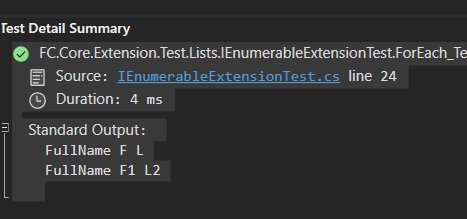

# FC.Extension.List

## IEnumerable Extension

The below method which iterates each item in the list and performs the provided action through "ActionMethod"

### Package

```bash
Install-Package FC.Core.Extension -Version 5.0.1
```

### Sample Code

```bash
using FC.Core.Extension.ListHandlers;


public async Task ForEach_Test()
{
    var items = new List<Item>();
    Item item1 = new Item()
    {
        FirstName = "F",
        LastName = "L"
    };
    Item item2 = new Item()
    {
        FirstName = "F1",
        LastName = "L2"
    };
    items.Add(item1);
    items.Add(item2);
    // populate items
    items.ForEach(item => ActionMethod(item));

    items.ForEach(item => Print(item));
    item2.FullName.ShouldNotBeNullOrEmpty();
    
}
void Print(Item item)
{
    _output.WriteLine($"FullName {item.FullName}");
}
void ActionMethod(Item item)
{
    item.FullName = item.FirstName + " " + item.LastName;
    // do something to item
}
```

### Output




Full Source code available in the Github.

IEnumerable Extension


